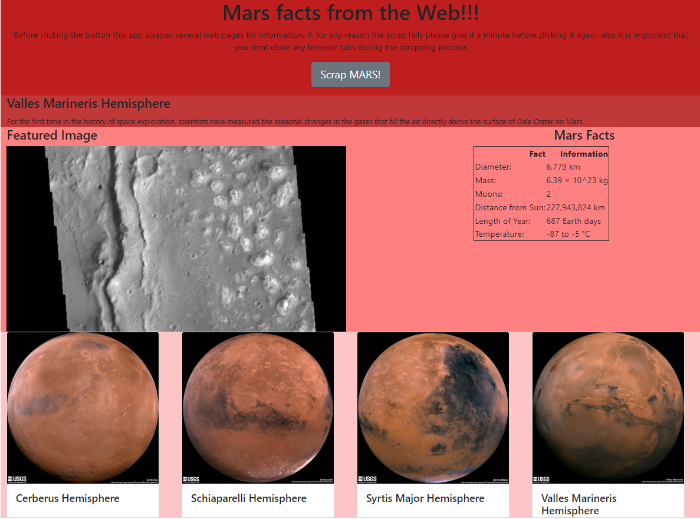

# Project Overview

By using beautiful soup, splinter, flask and MongoDB I scrap different webpages in order to build an application that displays relevant information about NASA mission to mars

# Application Overview

1. I start by scrapping [redplanetscience](https://redplanetscience.com/) in order to get the latest news from the mission to Mars
    - Initial scrap returns only empty results. The page only loads the news content with an onclick event, will use splinter to overcome this
2. Next, the app retrieves the featured image from Mars from [SpaceImages](https://spaceimages-mars.com/)
3. Now we retrieve some general facts about Mars from [MarsFacts](https://galaxyfacts-mars.com/)
4. Next, it is time to get some cool images from mars, we will scrap [MarsHemispheres](https://marshemispheres.com/index.html) for this
5. To get the first part done I create a single dictionary that contains all scrapped data, this will allow to use the script as a function and call it whenever we need
6. For the second part, I need to create a Flask API that scrapes the data and displays it into an html page, for this I converted the jupyter notebook to a python script and declared all the code as part of a function that will run when the API receives the call
7. The home page includes a button that does all the scrapping and displays the new data obtained in the same page



# Repository Structure
````bash
│   .gitignore
│   app.py
│   commits.md
│   LICENSE
│   README.md
│   scrape_mars.py
│
├───Missions_to_Mars
│   │   mission_to_mars.ipynb
│   │   table_test.html
│
├───templates
│       index.html
````

